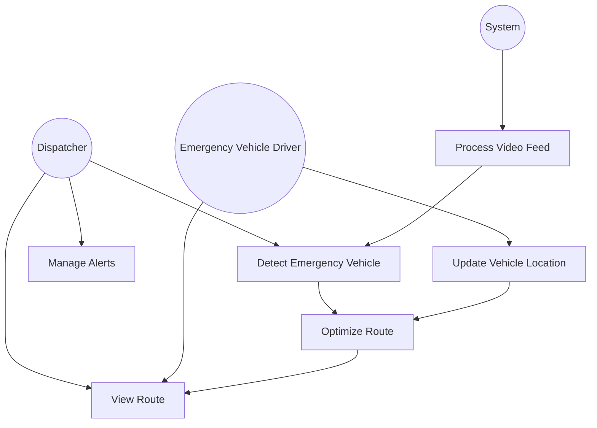
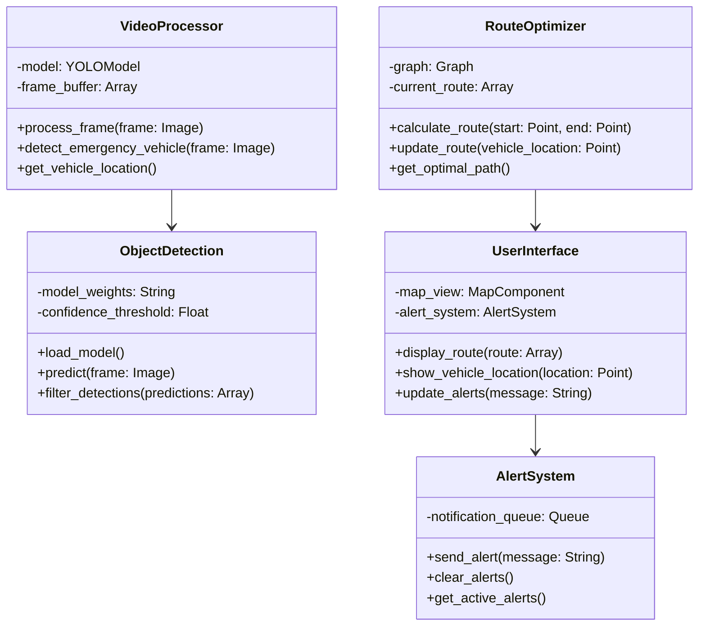

# UML Diagrams

## 5.2.1 Use Case Diagram



## 5.2.2 Class Diagram



## 5.2.3 Sequence Diagram

```mermaid
sequenceDiagram
    participant D as Dispatcher
    participant UI as UserInterface
    participant VP as VideoProcessor
    participant OD as ObjectDetection
    participant RO as RouteOptimizer
    
    D->>UI: Initialize system
    UI->>VP: Start video processing
    
    loop Every Frame
        VP->>OD: Process frame
        OD-->>VP: Return detections
        
        alt Emergency Vehicle Detected
            VP->>UI: Alert detection
            UI->>D: Show alert
            VP->>RO: Send vehicle location
            RO->>RO: Calculate optimal route
            RO-->>UI: Update route display
            UI-->>D: Show updated route
        end
    end
    
    D->>UI: Acknowledge alert
    UI->>RO: Confirm route
    RO-->>UI: Provide turn-by-turn directions
    UI-->>D: Display navigation instructions
